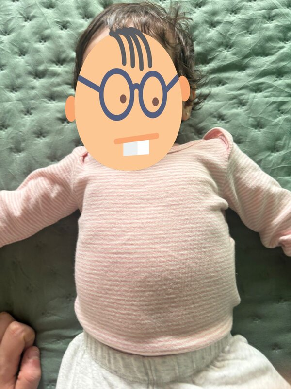

hmf - hide my face
==================
hmf is a small command-line tool that detects faces in an image and
replaces each detection with a user-supplied image.
It is written in C++ and uses OpenCV's YuNet DNN face detector, which
handles tilted, partial, profile and infant faces far more reliably
than the legacy Haar cascades.

Requirements
------------
In order to build hmf you need a C++11 compiler and OpenCV 4.5.4+ with
the `core`, `imgproc`, `imgcodecs`, `objdetect` and `dnn` modules
installed.

On Arch Linux:

    sudo pacman -S opencv

On Debian/Ubuntu:

    sudo apt install libopencv-dev pkg-config

On OpenBSD:

    doas pkg_add opencv

You also need `curl` to fetch the model the first time.

Installation
------------
Edit Makefile to match your local setup (hmf is installed into
the /usr/local/bin namespace by default).

Fetch the YuNet ONNX model (~230 KB) and build:

    make fetch-model
    make

Then install the binary, the manual page and the model:

    sudo make install

This places:

    /usr/local/bin/hmf
    /usr/local/share/man/man1/hmf.1
    /usr/local/share/hmf/yunet.onnx

Running hmf
-----------
Replace every detected face in `group.jpg` with `mask.png`, using the
installed model:

    hmf -i group.jpg -o anonymised.jpg -f mask.png

Run from the build tree (no install required) with verbose detection
output:

    ./hmf -v -m ./yunet.onnx -i baby.jpg -o out.jpg -f mask.png

Lower the confidence threshold to recover marginal detections (default
is 0.6):

    hmf -t 0.4 -i hard.jpg -o out.jpg -f mask.png

Grow the detected bounding box by 20% before overlaying, so the mask
also covers the forehead and chin:

    hmf -p 20 -i baby.jpg -o out.jpg -f mask.png

Options
-------
    -i input      source image (any OpenCV-readable format)
    -o output     destination image (encoder picked from extension)
    -f face       replacement image; PNG with alpha is blended properly
    -m model      path to the YuNet ONNX model
                  (default /usr/local/share/hmf/yunet.onnx)
    -t threshold  confidence threshold in [0.0, 1.0] (default 0.6)
    -p percent    grow each detected bounding box by N% before overlay,
                  keeping it centred (default 0; try 10-30 for tight
                  detectors like YuNet on baby faces)
    -v            verbose: print model path, image sizes and per-face
                  bounding box + score on stderr

Exit status is 0 on success and 1 on any I/O or argument error. A run
that detects zero faces still exits 0; the output is written unchanged.

How it works
------------
1. Load `input` and `face` with `cv::imread`. The face image is loaded
   with `IMREAD_UNCHANGED` so that PNG alpha channels are preserved.
2. Instantiate a `cv::FaceDetectorYN` from the YuNet ONNX model.
3. Run `detector->detect(input, detections)`. The result is an Nx15
   float matrix; columns 0..3 hold the bounding box (x, y, w, h) and
   column 14 holds the confidence score.
4. For every detection above the confidence threshold, clamp its box to
   the image, resize `face` to that size and blit it on top of the
   source.
   If `face` has an alpha channel, each pixel is blended with the
   underlying image; otherwise the region is overwritten.
5. Encode and write the result to `output`.

Caveats
-------
The YuNet model is not part of the source tree -- run
`make fetch-model` once to download it from the OpenCV Model Zoo into
the working directory before building or installing.

Heavy occlusion, motion blur or very low resolution can still cause
missed detections. Lowering `-t` recovers marginal detections at the
cost of false positives, especially on busy backgrounds.

License
-------
ISC - see LICENSE.
